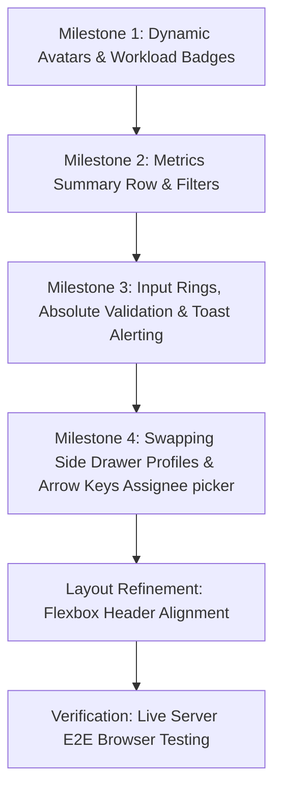

# LeapX Internship Project Management Board - Update Log (2026-07-17)

This document summarizes the workflow, logic, and code implementations completed on **July 17, 2026** for the Team Member Module redesign and UI integration.

---

## 1. Workflow & Implementation Logic

The development was divided into independent, progressive milestones. Each milestone was committed to the feature branch `feature/responsive-team-member-ui` using Conventional Commits.



---

## 2. Technical Breakdown of Work Done

### Milestone 1: Avatars & Workload Component Design
*   **Location**: [avatar.css](file:///Users/sankalptiwari/Documents/LeapX_Internship/Project-Management-Board-2/css/avatar.css), [other-views.css](file:///Users/sankalptiwari/Documents/LeapX_Internship/Project-Management-Board-2/css/other-views.css)
*   **Logic**: Standardize responsive sizing modifiers (`xs`, `sm`, `md`, `lg`, `xl`) and replace hardcoded hexadecimal colors with theme-dependent design tokens (`var(--color-surface)`, `var(--color-border)`, `var(--color-text-muted)`). Added hover scaling transitions and focus-visible rings for keyboard navigators.
*   **Workload Badging**: Created dynamic status badges (`low`, `medium`, `high`) mapping workload intensity categories to theme color badges.

### Milestone 2: Metrics Grid Row & Filters
*   **Location**: [ui.js](file:///Users/sankalptiwari/Documents/LeapX_Internship/Project-Management-Board-2/js/ui.js) (`renderTeam`)
*   **Logic**: Integrated a dashboard-style metrics row in the Team view showing live statistics:
    *   **Filtered Members**: Total count of visible profiles.
    *   **Active Members**: Count of team members with 1+ active tasks.
    *   **High Workload**: Count of members with 3+ active tasks.
    *   **Assigned Tasks**: Sum of all tasks in-progress across columns.
*   **Filtering**: Programmed search input events and role/workload drop-down filter selection handlers. When filters trigger, the list filters reactively, redraws cards, and updates metrics.
*   **Workload Progress Bars**: Swapped the text task indicators for a responsive progress indicator bar showing `completed/total` tasks percentage.

### Milestone 3: Modal Inputs & Floating Toast Notifications
*   **Location**: [member-modal.css](file:///Users/sankalptiwari/Documents/LeapX_Internship/Project-Management-Board-2/css/member-modal.css), [index.html](file:///Users/sankalptiwari/Documents/LeapX_Internship/Project-Management-Board-2/index.html), [main.js](file:///Users/sankalptiwari/Documents/LeapX_Internship/Project-Management-Board-2/js/main.js)
*   **Form Usability**: Added focused border-rings to modal form elements. Validation error labels were placed inside absolute containers (`position: absolute`) below input groups to prevent form layout shifts when warnings appear.
*   **Toasts Alerting**: Coded a CSS-transitioned toast notification widget sliding up from the bottom right on successful additions, updates, and removals of team profiles.

### Milestone 4: Profile Details Drawer & Keyboard Dropdown Accessibility
*   **Location**: [main.js](file:///Users/sankalptiwari/Documents/LeapX_Internship/Project-Management-Board-2/js/main.js), [ui.js](file:///Users/sankalptiwari/Documents/LeapX_Internship/Project-Management-Board-2/js/ui.js)
*   **Drawer Reuse**: Capped task details side panel (`#side-peek`). When clicking on a member profile, the pane swaps to display a rich profile overview containing task stats, a list of assigned tasks, and recent activity logs.
*   **Recursive Navigation**: Clicking on any task inside the member's assigned tasks drawer list automatically redirects and re-populates the drawer with that specific task's edit form layout.
*   **Keyboard Assignee Selector**: Enabled ArrowUp/ArrowDown navigation and Enter/Space selections on items inside the floating assignee drop-down picker to satisfy WAI-ARIA guidelines.

### Layout Refinement: Header Flexbox Alignment
*   **Location**: [member-modal.css](file:///Users/sankalptiwari/Documents/LeapX_Internship/Project-Management-Board-2/css/member-modal.css) (`.modal-header`)
*   **Logic**: Adjusted the header layout container holding the title "Manage Team Members" and the close button to use flex alignment:
    ```css
    .modal-header {
      display: flex;
      justify-content: space-between;
      align-items: center;
    }
    ```
    This resolves a slight misalignment, centering the text and icon vertically along the same baseline.

---

## 3. Git Commit History Summary

The following commits describe the work logged today:

1.  `feat: redesign avatar and avatar group components`
2.  `feat: implement team dashboard metrics and search filters`
3.  `feat: enhance team management modal inputs and toast alerts`
4.  `feat: link team cards to profile drawer and support keyboard arrows in assignee dropdown`
5.  `style: align close button horizontally in manage team modal header`
