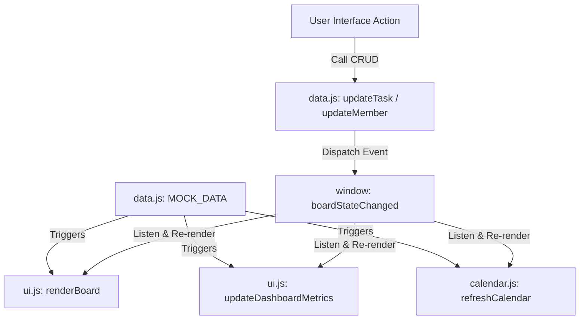

# Project Analysis: Project Management Board

This document provides a comprehensive overview of the **Project Management Board** frontend architecture, data flows, core rendering lifecycles, and design decisions.

---

## 1. Project Overview & Tech Stack

The **Project Management Board** is a highly interactive, responsive project workspace designed as a Single Page Application (SPA). It provides teams with a centralized interface to manage tasks, coordinate sprint columns, view developer workloads, track progress metrics via real-time charts, and view scheduled tasks on a monthly calendar grid.

### Technology Stack
1.  **Core Structure**: Semantic HTML5 elements (`<article>`, `<section>`, `<header>`, etc.) with interactive elements styled for modern accessibility.
2.  **Styling**: Vanilla CSS3 using custom CSS variables (design tokens for colors, spaces, typography, layers, and dark-theme mappings), custom flex/grid structures, glassmorphism filters, transitions, and keyframe animations.
3.  **Client-Side Logic**: Modern ES6+ JavaScript modules (native `import`/`export` syntax). No external bundling or frameworks (Webpack, Vite, or React) are used.
4.  **Local Server & Verification**: Served locally using static file serving via `npx serve`.

---

## 2. Directory Structure

```
Project-Management-Board-2/
├── css/                          # Application Style Sheets
│   ├── avatar.css                # Avatar and Group layout variables
│   ├── board.css                 # Kanban Board grid & columns
│   ├── dropdown.css              # Custom dropdown overlays (Assignee Select)
│   ├── layout.css                # Global Reset, Scrollbars, and Containers
│   ├── member-modal.css          # Team management CRUD modals
│   ├── other-views.css           # Calendar grid, Charts layout, list, & table views
│   ├── responsive.css            # Media Queries & Mobile optimization
│   ├── style.css                 # Variables, Core Theme toggles, and Buttons
│   ├── task-editor-modal.css     # Task Side-Peek drawer layout
│   └── task.css                  # Task cards and priority styling
├── doc/                          # Audit reports
│   └── review.md                 # Integration phase verification
├── docs/                         # Developer Onboarding & Architecture Docs
│   ├── PROJECT_ANALYSIS.md       # (This file) Core architecture & flow
│   ├── FEATURE_DOCUMENTATION.md  # Detailed feature/module breakdown
│   └── IMPLEMENTATION_NOTES.md   # Limitations, limitations, and improvements
├── js/                           # Native ES Modules
│   ├── calendar.js               # Calendar grid rendering & navigation
│   ├── data.js                   # Primary Data store, CRUD wrappers & migrations
│   ├── dragdrop.js               # HTML5 Native Drag & Drop triggers
│   ├── main.js                   # Routing, View state toggles, and bootstrapping
│   ├── task-editor-modal.js      # Task Edit side-peek controller & auto-save
│   └── ui.js                     # Shared renderers (Board, Charts, Logs, KPI)
├── index.html                    # Single entrypoint HTML page
├── package.json                  # Script execution configurations
└── README.md                     # High-level overview
```

---

## 3. Application Architecture & Life Cycles

The application operates as a **unidirectional data-driven system** coordinated via client-side local storage and dynamic custom events.



### 3.1. State Management
*   **State Store**: Held in `js/data.js` via the `MOCK_DATA` object. This object holds:
    *   `columns`: Array of sprint columns containing titles and ordered arrays of task IDs.
    *   `tasks`: Dictionary mapping task IDs to task objects.
    *   `activityLog`: Chronological list of user action descriptors.
*   **Database Wrappers**: `js/data.js` acts as the data layer API, exposing mutators (`createTask`, `updateTask`, `deleteTask`, `addMember`, `updateMember`, `deleteMember`) that automatically sanitize inputs, perform schema upgrades, and persist state.

### 3.2. LocalStorage Persistence
*   **Data Key**: The primary data state is persisted under `'pm-board-state-v1'` in `localStorage`.
*   **Seeding & Migrations**: During initial bootstrap, `initData()` in `data.js` checks for existing entries. If none are found, it seeds the store using the default mock database configuration. If data is found, it runs schema migrations (`migrateData()`) to add any missing fields (such as subtasks, checklists, or assigned team members) to legacy tasks.
*   **View Persistence**: Subview preferences (e.g. Board vs List vs Table views, Sidebar collapsed/open, active navigation tab, and activity log drawer state) are cached under separate local storage flags (`boardSubView`, `sidebarSection`, `theme`, and `activity-log-open`).

### 3.3. Event-Driven Architecture
To keep decoupled views (Kanban board, charts, calendar, and activity log) synchronized without complex model-view binding libraries, the application uses **custom DOM events**:
1.  **`boardStateChanged`**: Dispatched on any task or member creation, editing, status change, or deletion. Views subscribe to this event to trigger complete re-rendering.
2.  **`activityLogUpdated`**: Dispatched when a new user audit entry is written to log, triggering the update of the activity feed panel.

### 3.4. Component Interactions
When a user updates a task inside the side-peek drawer:
1.  The UI collects inputs and calls `updateTask(taskId, updatedFields)`.
2.  `updateTask` updates the task in `MOCK_DATA`, calls `saveMockData()` to write to `localStorage`, appends an activity entry, and dispatches the `boardStateChanged` event.
3.  The global event listener in `main.js` catches the event and triggers re-renders of the board, calendar, workload charts, and table lists.

---

## 4. End-to-End Data Flow

### 4.1. Task Lifecycle
```
[User Clicks Add Task] 
      │
      ▼
[Populates Task Modal (Title, Due Date, Assignee, Priority)]
      │
      ▼
[Submit Action] ──► calls createTask() in data.js 
                        │
                        ▼
                  [Generate UUID task-17xx]
                        │
                        ▼
                  [Push ID to MOCK_DATA.columns[col-backlog]]
                        │
                        ▼
                  [Save to localStorage] ──► Dispatches boardStateChanged
```

*   **Move / Drag**: Dragging a task card changes its DOM container. The `dragdrop.js` handlers capture the drop column, recompute the columns' task arrays via `syncBoardDOMToState()`, update task statuses, save state, and dispatch `boardStateChanged`.
*   **Editing**: Double-clicking a task opens the side-peek modal (`openTaskEditor`). Input events trigger **auto-saving** (throttled by 1000ms timeouts) saving progress to local storage in the background.
*   **Deletion**: Deleting a task calls `deleteTask(taskId)`, which filters out the task ID from its column, removes the task object from the dictionary, writes the change, and fires `boardStateChanged`.

### 4.2. Team Member Lifecycle
*   **Creation**: Adding a member through the team CRUD panel calls `addMember()`, generating initials, assigning a distinct avatar color, updating `TEAM_MEMBERS` in storage, and re-rendering dropdowns.
*   **Cascade Unassignment (Data Safety)**: When a member is deleted via `deleteMember()`, a cleanup loop runs over all tasks in `MOCK_DATA.tasks`. Any task referencing the deleted member's ID as the assignee is automatically set to empty (`assignee: ""`). This prevents broken references in task editors, dropdowns, and cards.

---

## 5. Core Utilities & Helper Functions

These shared functions are located in `js/ui.js` and `js/data.js`:

*   `getInitials(name)`: Takes a full name string (e.g. "Sai Shendge") and returns the capitalized initials (e.g. "SS"). Handles single-word names and empty fallbacks.
*   `getColorForUser(name)`: Retrieves the associated avatar background hex code of a team member, with fallback algorithms.
*   `formatTimestamp(timestamp)`: Formats ISO date strings into local representations for log timelines.
*   `getMemberMetrics(memberId, tasks)`: Dynamic workload evaluation utility. Calculates:
    *   `completed`: Count of tasks assigned to `memberId` in `'done'` status.
    *   `inProgress`: Count of tasks assigned to `memberId` in all non-done statuses.
    *   `completionPercentage`: Ratio of completed to total tasks.
*   `createAvatar(memberId, name, color)`: Helper utility to create an accessible HTML element representing a user avatar, complete with tooltip title.
